

  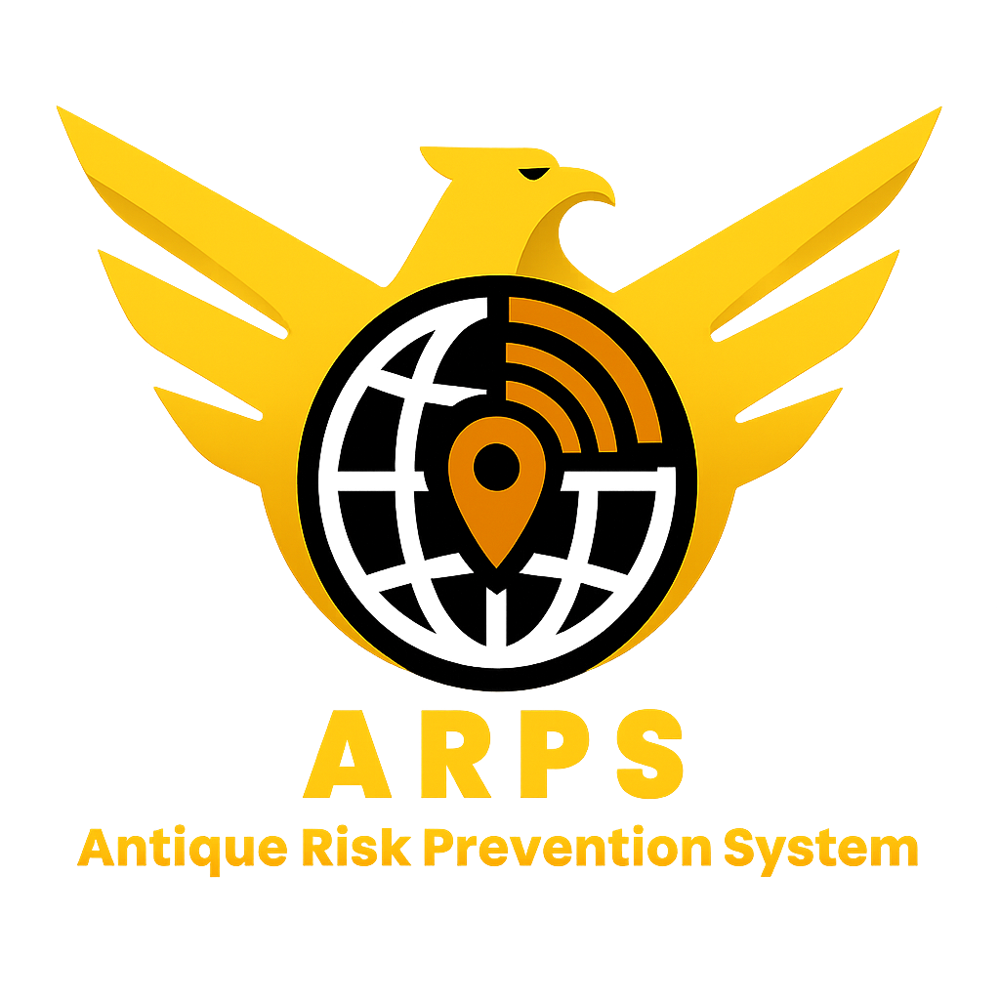

<h1 align="center">Antique Risk Prevention System</h1>

  A system designed to help identify, assess, and manage risks occurring in Western Visayas Antique Region.

# Table of Contents

- [Team](#team)
- [System Overview](#system-overview)
- [Installation](#installation)
- [Features](#features)
- [Application Walkthrough](#walkthrough)
- [APIs](#application-programming-interface)
- [Future References](#future-references)
- [AI Tools](#use-of-ai-tools)

# Team
The Project is a creation of the Team Cyberians from Saint Anthony's College as an entry for the 𝗞𝗼𝗺𝘀𝗮𝗶 𝗛𝗮𝗰𝗸 𝟮𝟬𝟮𝟲: 𝗥𝗶𝘀𝗸𝗥𝗲𝗮𝗱𝘆 hosted by the University of the Philippines Miag-ao

## Team Members
1. Almonzor Manzan - Hacker/Project Lead
2. Khing Jay Regala - Hacker
3. Alleah Wendine Tejares - Hipster
4. Marl Ellie Alfonga - Hipster
5. Ian Jude C. Fabila - Hustler

 

# System Overview
The Antique Risk Prevention System (ARPS) is a dedicated web application designed to protect the people of Antique by providing real-time tools for disaster preparedness and emergency response. By installing it as a mobile-friendly app, users gain a reliable lifeline that works even during extreme situations when internet access is limited. Residents can instantly send SOS alerts with their precise location, find the safest routes to nearby evacuation centers, and receive live weather updates. For local authorities (MDRRMO), the system serves as a powerful command center to track incoming reports and coordinate fast, life-saving assistance across the province.

# Installation

You can Install the Web Application in your device for a better experience enabling you offline access in cases of extreme emergencies

## Steps to Install
1. Open the [Antique ARPS Web App](https://antique-arps.com) in your Browser.
2. On the landing page on the top right you can **click on the install button**

   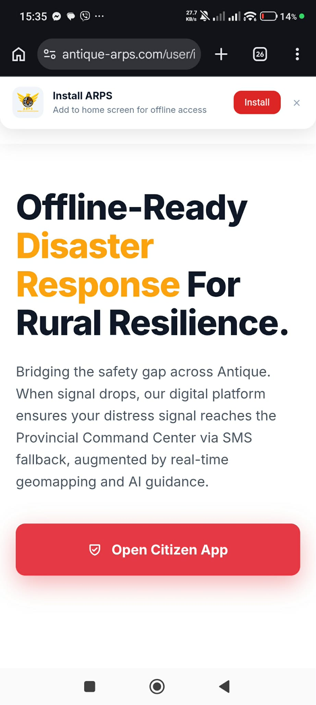
3. After doing so, some of the ARPS features will now be accessible offline.

# Primary Features
* **Offline Access:** Install the application directly to your device home screen. This allows you to access critical safety information and emergency guides even during total internet blackouts, and also has an offline SMS integration for when there is no internet connection available.
* **One-Tap SOS System:** Send immediate emergency alerts to the MDRRMO. The system intelligently uses PhilSMS for internet-based alerts but automatically falls back to your phone’s native SMS app if you are offline.
  * **Emergency Severity Scale:** The system automatically determines the priority level of an incoming SOS to help responders allocate resources. It evaluates **Role-Based Vulnerability** (flagging alerts from highly vulnerable demographics like the elderly, children, or PWD with a higher baseline severity) and **Community Threat Mapping** (dynamically upgrading the severity level if a high volume of SOS alerts originates from a single community simultaneously, signaling a large-scale disaster).
* **Smart Evacuation Routing:** Find the nearest "Safe Zones" and evacuation centers instantly. The system uses the Overpass API to locate facilities and provides real-time navigation to guide you safely to your destination.
* **Real-Time Weather Intelligence:** Stay ahead of hazards with live weather updates and storm tracking powered by Open-Meteo localized specifically to your current GPS coordinates.
* **Live Incident Mapping:** For administrators, a real-time "Live Map" visualizes all active SOS signals across the municipality, allowing for faster response times and better resource management.
* **Offline Risk-Mitigation AI Chatbot:** Powered by an LLM (Large Language Model) for advanced, natural interactions online, this chatbot serves as a critical safety guide to help users minimize risks. To ensure absolute reliability during complete network blackouts, the system seamlessly transitions to a locally-cached offline mode. Using offline keyword matching and text parsing, it provides users with uninterrupted, real-time access to vital 'Self-Rescue' instructions and emergency guidance, even without an internet connection.

# Walkthrough

## Admin
The Admin page will primarily be handled by the respected MDRRMO in their respective municipalities in Antique in order to receive emergency alerts and define areas with possible hazards and risks.

  
<strong>Click to view: Admin Walkthrough</strong>

  **Admin Login:** To ensure secure access, administrators from the MDRRMO must authenticate on the secure login page using the account "admin@gmail.com" with the password "admin1234", which can be accessed via [Antique ARPS Admin Page](https://antique-arps.com/admin/index.html)
  
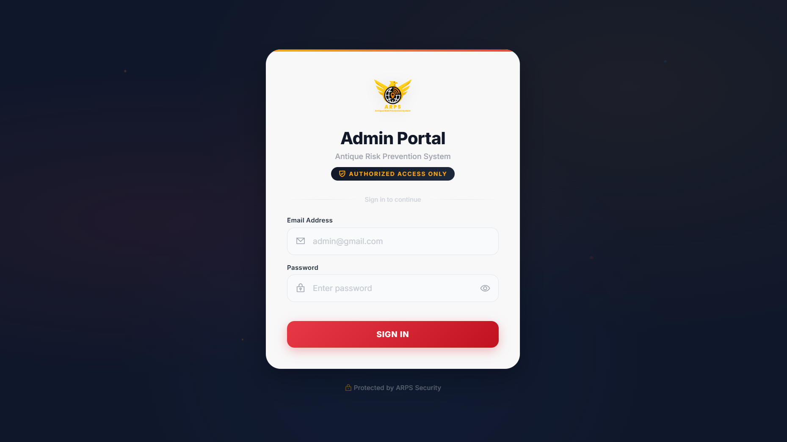

  **Admin Dashboard:** The Admin Dashboard provides the operator with a comprehensive overview of all incoming emergency requests from users. This includes critical real-time data, such as the exact location of the user and the specific type of emergency reported.
  
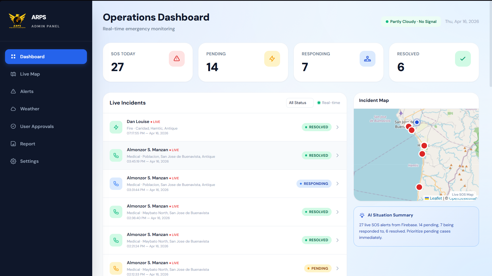

  **Live Map:** By clicking "Live Maps" on the left navigation menu, the operator is directed to an interactive map displaying real-time, active incident mapping across the municipality, where the operator can visibly see the locations of users' SOS alerts. 
  
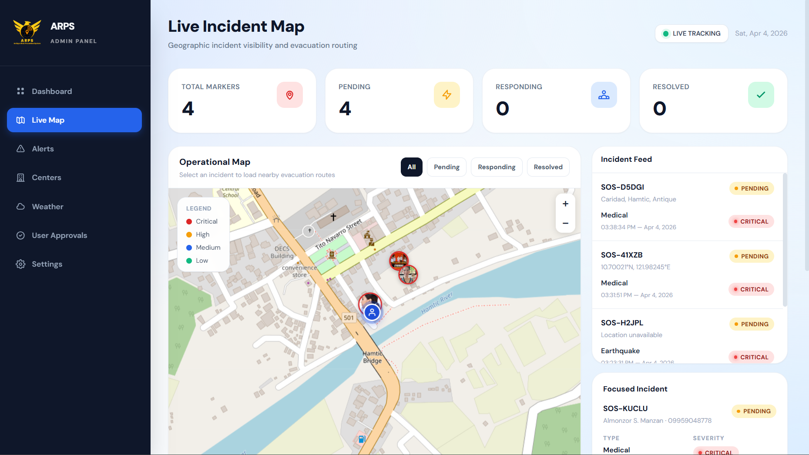

  **Alerts:** Upon selecting "Alerts" from the navigation menu, the operator is directed to the Alerts Management page. This dashboard displays comprehensive SOS report details, AI-generated summaries, and the volume of SOS requests categorized by location.
  
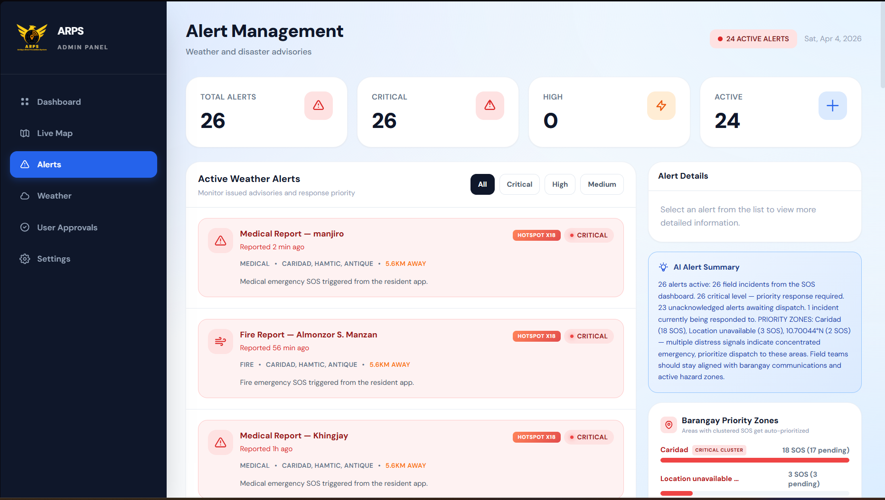

  **Weather:** By tapping "Weather" in the left navigation menu, the operator is directed to the Weather Intelligence page. This displays localized info based on the PAG-ASA Weather API for the municipality's coordinates.
  
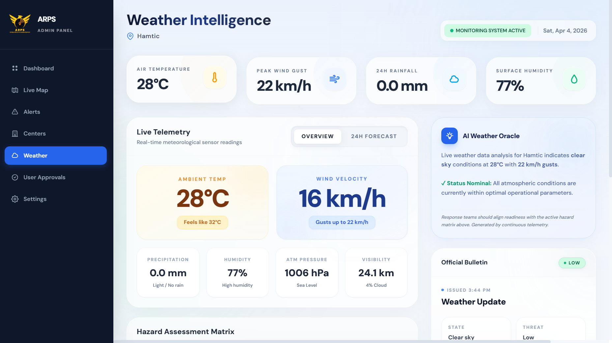

  **User Approval:** In the Users Approval page, the operator/admin can authenticate and approve new user accounts after verifying their submitted identity documents.
  
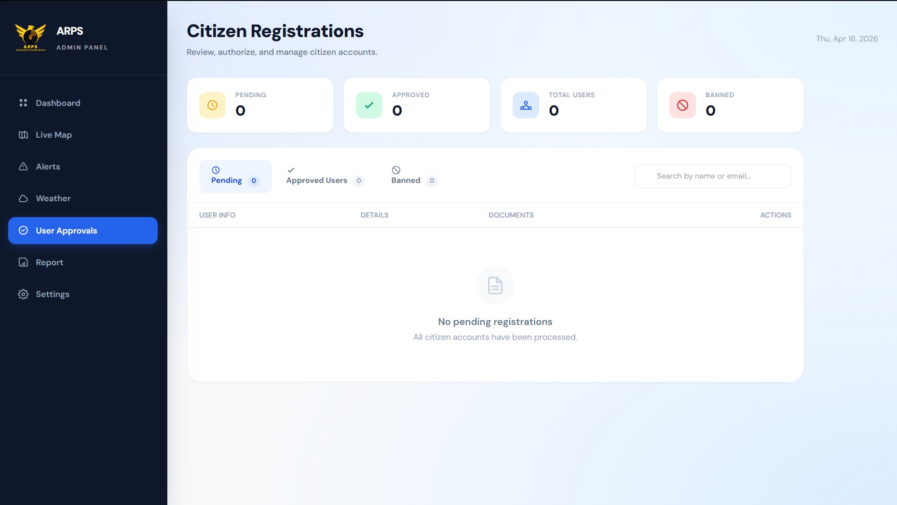

  **Reports:** The Reports page provides admins with a centralized dashboard to track all SOS requests. It categorizes total incidents by status (pending, responding, resolved) and logs specific emergency types. Users can easily filter records by timeframes such as today, this week, or all time and apply custom criteria to pinpoint exact data, which can then be printed or exported as a CSV file.
  
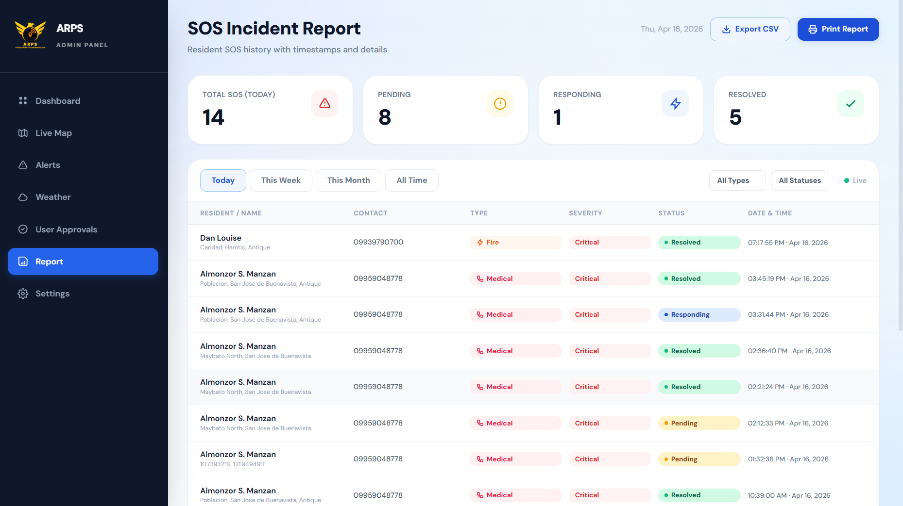

  **Settings:** In the settings page, the operator can configure the **Offline Service Number**. This number is used to receive SOS alerts via SMS from users who do not have internet access.
  
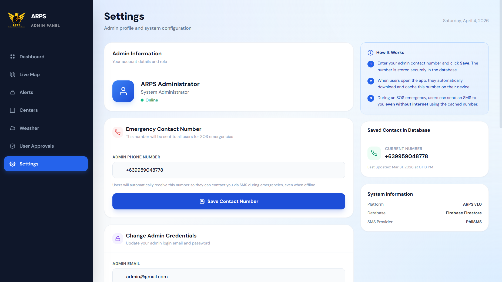

## User Walkthrough
The User Dashboard is the main home screen where users can access and interact with all of the app's core features.

  

    <strong>Standard User Walkthrough</strong>
  

  ### 1. Login Process
Here is the step-by-step process for users to authenticate and access the system securely.

**Step 1:** Users begin at the ARPS landing page. By tapping the **"Open Citizen App"** button, they will be directed to the Login portal.  

  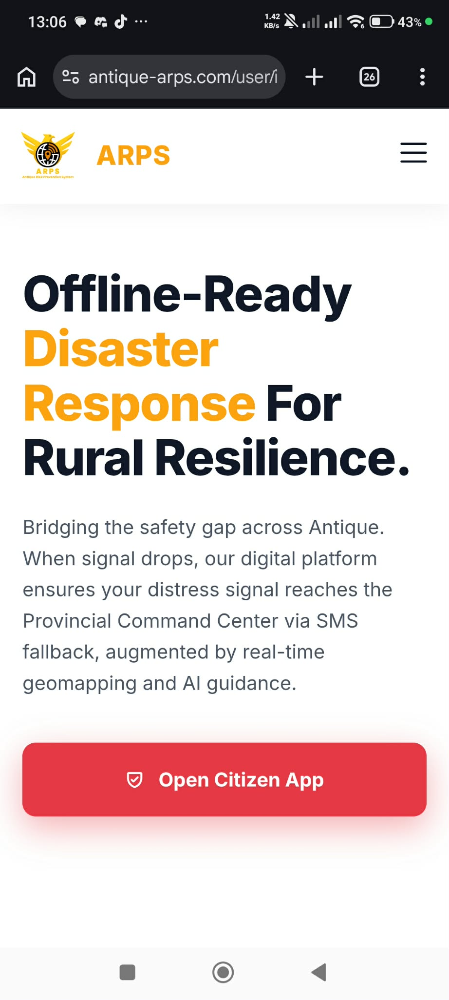 

**Step 2:** New users can register their accounts by inputting their Name, Email, and Password, while returning users can quickly access their accounts via the Sign In page.

  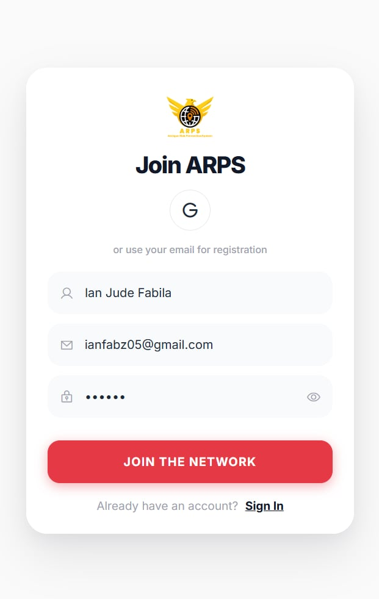 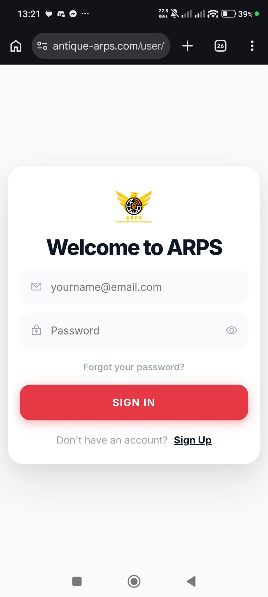

> **Note:** Users only need to perform a **one-time login**. Once authenticated, the system keeps you logged in so that the SOS button and critical emergency features are instantly accessible in high-pressure situations without needing to re-enter credentials.

**Step 3:** In this page, the user will have to input their personal information such as Name, Age, Contact Number, Address, and Gender.

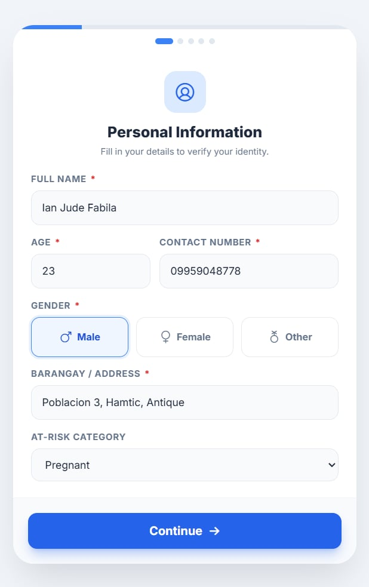

**Step 4:** A facial and ID verification using the phone's camera will be conducted to further authenticate the user which the admins can manually authenticate.

  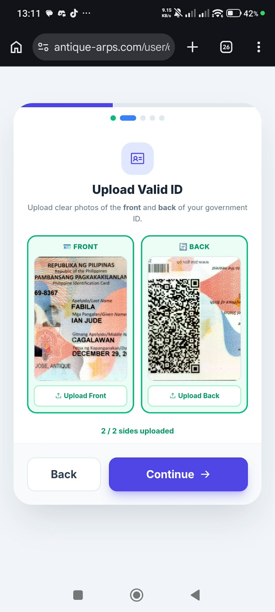
  &nbsp;&nbsp;&nbsp;
  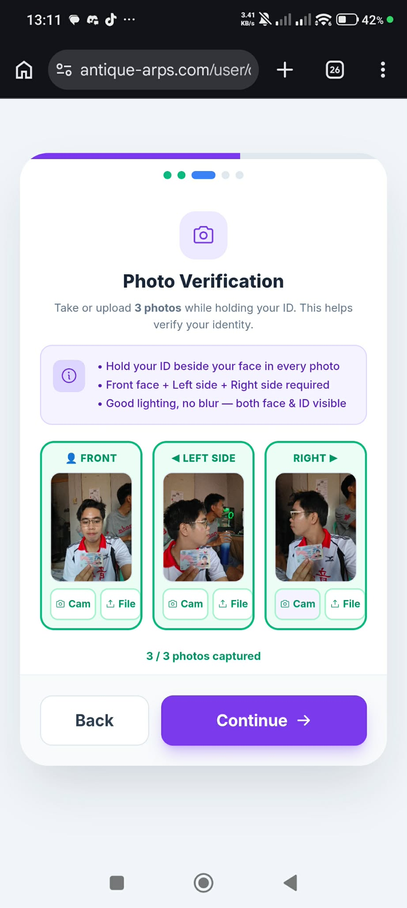

> **Anti-Troll Measure:** This verification steps ensures accountability. Any user found sending malicious or fake SOS signals will be identified and reported to authorities for violating **Presidential Decree No. 1727**, which penalizes the dissemination of false information and emergency alarms.

**Step 5:** In this page the user can read and agree to the terms and services of using the ARPS system. 

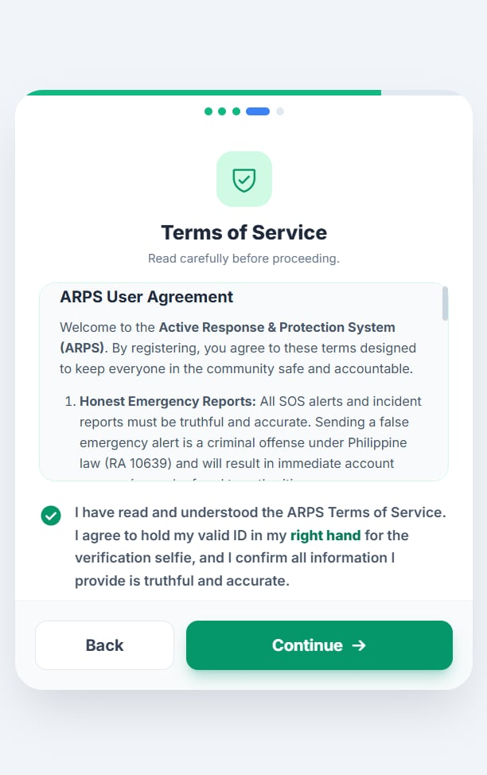

**Step 6:** This page confirms the information the user has provided to ensure everything is correct before moving forward.

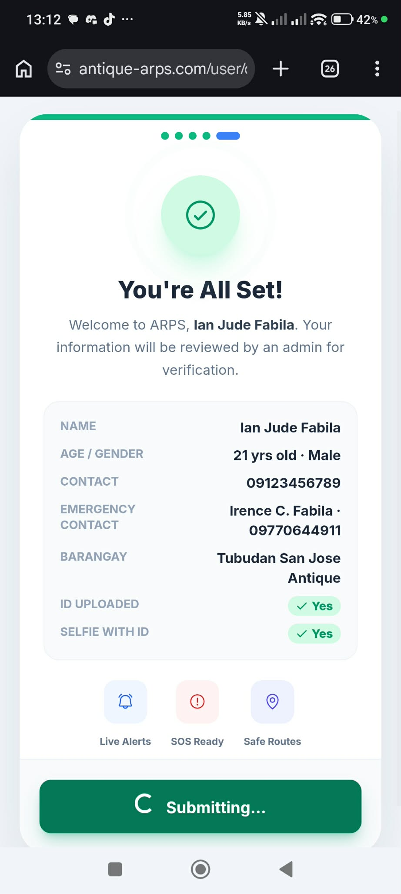

**Step 7:** This page confirms the submission and informs the user that their account is pending. They must wait for an administrator to manually verify their submitted ID picture before gaining full access.

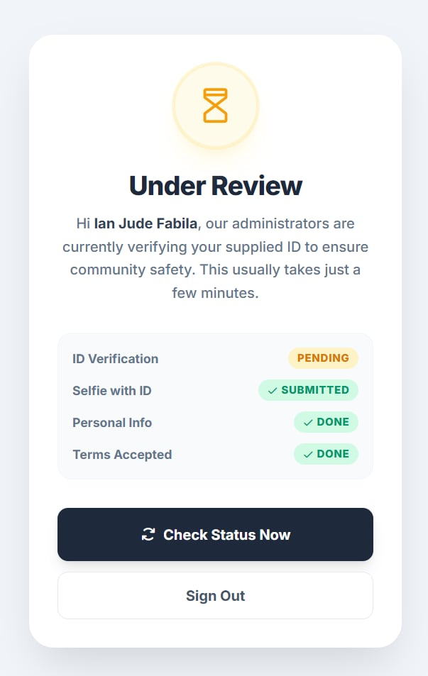

   

  ### 2. Main Dashboard
Once logged in, users are greeted by the main page where they can navigate the system.

**Overview:** The main dashboard gives the user tips and information that can be helpful in times of need. This includes an SOS button, AI-driven contextual tips, and the Nearest Home Shelter based on your current location.

**SOS Button:** When the SOS button is clicked, this page will appear prompting the user to select what kind of emergency they are experiencing so that the appropriate help can be dispatched immediately.

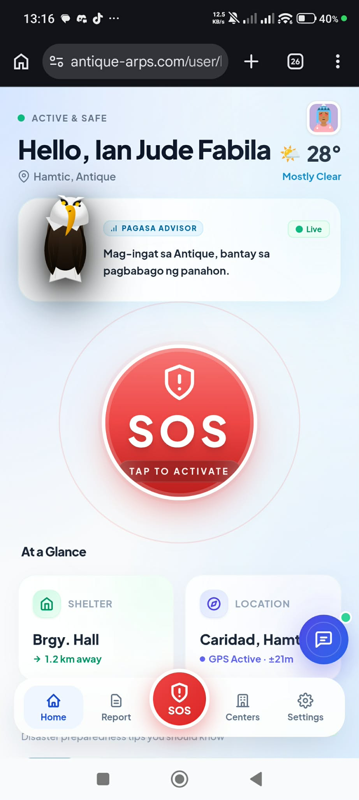 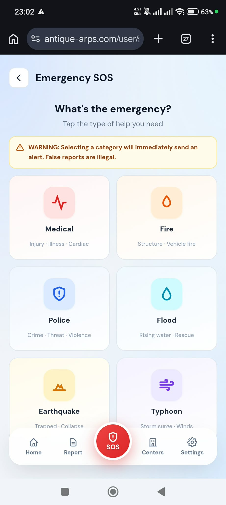

> **Legal Warning:** To protect the integrity of the system and ensure responders are available for real emergencies, **prank reporting is strictly prohibited.** False reports are a criminal offense under **Presidential Decree No. 1727** and **Article 155 of the Revised Penal Code (Alarms and Scandals)**. Violators will be tracked via their verified ID and face legal prosecution.
 

> **Offline SOS Capability:** The SOS button is designed to save lives even during total internet blackouts. If no connection is detected:
> 1. The system automatically retrieves your **last recorded location** from the secure local cache.
> 2. It triggers a **fail-safe SMS fallback** to the administrator's emergency line.
> 3. The message includes an automated **Google Maps location link**, allowing responders to navigate to your position using GPS coordinates even without a data signal.

**Reports:** After an SOS is sent, users can track the status of their emergency on the Reports page. This is easily accessible by tapping the Reports icon on the bottom navigation bar. It also provides situational guidance while you wait for help.

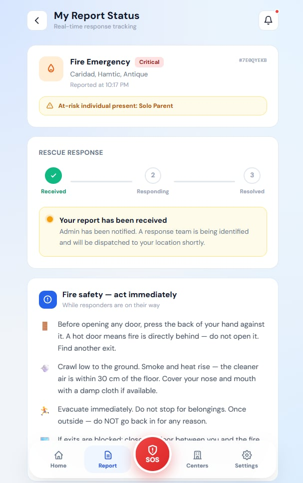

**Centers & Routing:** By tapping "Centers" in the bottom navigation menu, users can easily locate the nearest evacuation center. The app will also calculate and display the best route to safely guide the user to their destination.
  

    
    &nbsp;&nbsp;&nbsp;
    
  

**Settings/Profile:** In the settings page, users can view and edit their profile information to ensure their emergency contact details and health info stay up to date.

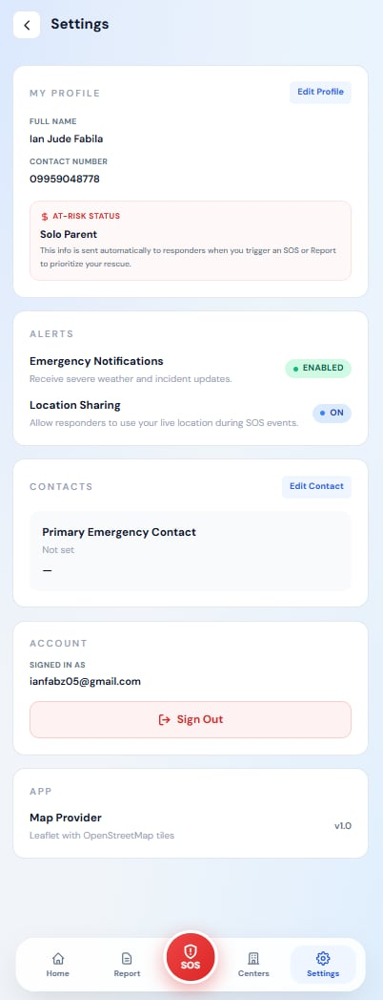

**ARPS AI Assistant:** The system features an integrated AI Assistant that provides real-time, context-aware advice. It offers immediate safety protocols and disaster-preparedness tips tailored to the user's current environment and active hazards.

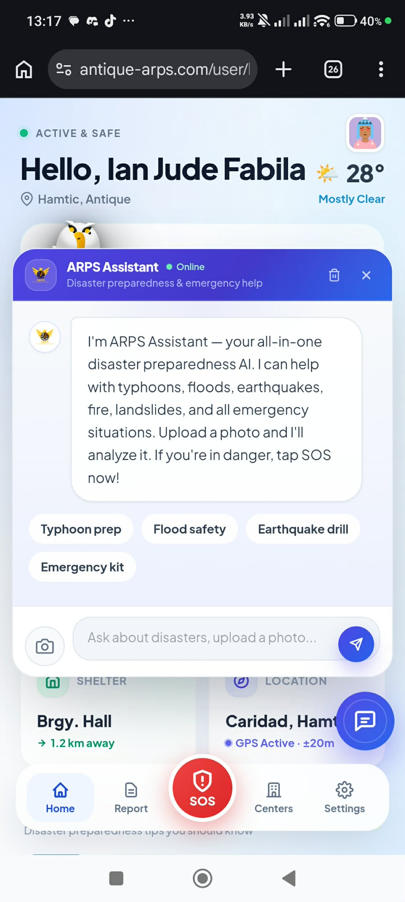

 

# Application Programming Interface
These API'S are the External Services Used in the System

### 1. Nominatim (Address Finder)
* **What it does:** It translates raw GPS coordinates (latitude and longitude) into a readable human location, like "Street, Barangay, Province."
* **How it helps:** When the app detects exactly where you are on the map, it uses this service to figure out your actual street address and display it on the screen.

### 2. BigDataCloud (Backup Address Finder)
* **What it does:** This is our backup tool for finding addresses, specifically tuned to recognize Philippine "Barangays."
* **How it helps:** If the main address finder is running slow or is temporarily unavailable, the app automatically switches to this service so you never lose your location details.

### 3. PhilSMS (Emergency Text Messenger)
* **What it does:** It is a service that sends out automated SMS text messages over the internet.
* **How it helps:** When you press the SOS button, this service instantly texts your emergency contacts with your current location and the type of emergency. If you don't have internet access, the app is smart enough to open your phone's regular texting app so you can still send the message manually.

### 4. PAG-ASA Weather API
* **What it does:** It acts as the app's personal weatherman by checking the conditions at your exact GPS coordinates.
* **How it helps:** It fetches the real-time temperature, wind speed, and weather status (like "Rainy" or "Mostly Clear") and displays them right on your home screen so you can stay informed about the environment around you.

### 5. Overpass API (Safe Zone Locator)
* **What it does:** It acts like a highly specific search engine for buildings on a map.
* **How it helps:** It scans the immediate area around your current location to find nearby evacuation centers, emergency facilities, and barangay halls. It then takes those locations and drops marker pins on your map so you know exactly where to go in an emergency.

# Future References

### 1. Signal-Independent Messaging
The current system utilizes **Phil SMS**, which requires a standard cellular signal to function. To improve reliability in "dead zones" or during network outages, we propose integrating more resilient messaging technologies:

* **Emergency Roaming:** Implementing protocols similar to 911 services, allowing the system to transmit data via any available carrier tower regardless of the SIM provider.
* **Satellite-to-Cell APIs:** Utilizing Non-Terrestrial Network (NTN) connectivity to ensure message delivery in remote areas without traditional cell tower coverage.
* **LoRaWAN Mesh Networks:** Enabling peer-to-peer message relaying through long-range radio frequencies, bypassing cellular infrastructure entirely.

### 2. Geographic Expansion & Nationwide Scaling
Currently, the system is explicitly designed for and geo-fenced to the province of Antique. For future development, to maximize the platform's impact and disaster response capabilities, we propose scaling the architecture for a nationwide deployment:

* **Nationwide Rollout:** Expanding the system infrastructure and cloud resources to support full operation across the entire Philippines.
* **Dynamic Geo-Fencing:** Upgrading the current static, single-province geo-fence to a dynamic system, allowing various Local Government Units (LGUs) nationwide to define and manage their own specific jurisdictions.
* **Cross-Provincial Coordination:** Enabling the system to handle inter-province alerts and data sharing, ensuring seamless communication during large-scale national emergencies.

### 3. Enhanced SOS Reporting Capabilities
Currently, the SOS button triggers a standard alert. To provide responders with better situational awareness and actionable context, we propose upgrading the SOS functionality with voice telemetry:

* **Voice-Enabled SOS Alerts:** Allowing users to record and attach short voice messages directly to their SOS ping. This enables individuals in distress to quickly elaborate on their specific needs (e.g., medical requirements, specific location details) without the time-consuming process of typing.

### 4. Automated Identity Verification & Fraud Detection
Currently, the system relies on a manual approval process where administrators must verify users by cross-referencing submitted ID photos with facial selfies to prevent troll accounts and fake SOS alerts. To improve onboarding efficiency and enhance security at scale, we propose automating this workflow:

* **AI-Powered KYC Integration:** Implementing automated "Know Your Customer" (KYC) APIs that use machine learning to instantly detect fraudulent or tampered IDs, verify document authenticity, and perform facial matching without human intervention.
* **Biometric Liveness Detection:** Upgrading the face verification step with real-time liveness checks (e.g., requiring the user to blink or move their head) to ensure they are a live human and not submitting a static photo of a photo.
* **PhilSys API Integration:** Exploring integration with the Philippine Identification System (PhilSys) for seamless, government-validated identity checks. This would create an air-tight deterrent against malicious actors and strictly enforce accountability for false emergency reports.

# Use of AI Tools

**Tool Used:** 
### Google Gemini

**Role:** Development Assistant & Debugging Support

* **SOS Alert Sound Toggle:** Assisted in structuring and troubleshooting the backend logic for a dedicated audio toggle, ensuring that critical SOS alert sounds can be enabled or muted reliably without affecting the delivery of visual emergency notifications.
* **UI/CSS Troubleshooting:** Helped identify and fix CSS layout and responsiveness issues to maintain a clean user interface.
* **Admin Mapping Integration:** To find the official source of the Leaflet API and retrieve the correct developer settings for the map's foundation.
* **Evacuation Routing Logic:** Aided in refining the data-handling logic used to fetch, filter, and display nearby evacuation centers accurately.